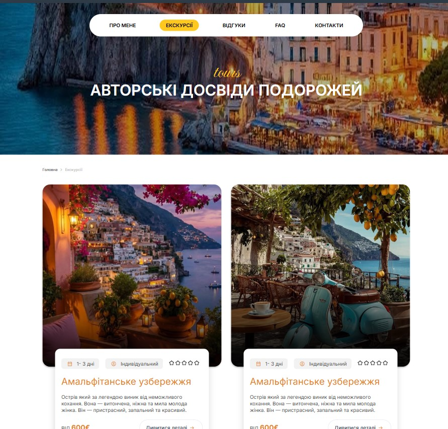
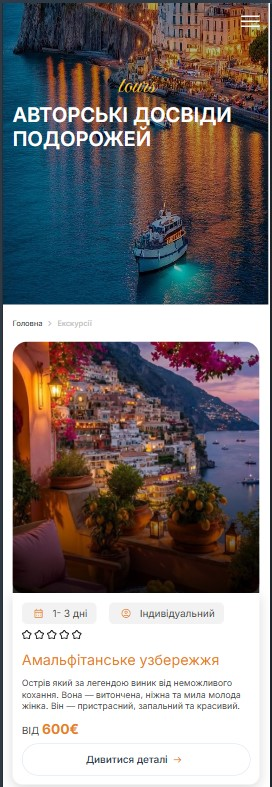

# Turismo in Italia — Demo Website

A multi-page tourism website demo about travelling in Italy, built as a front-end portfolio project. The Figma mockup was implemented in code with HTML, CSS and JavaScript.

🔗 **Live demo:** https://zhuridochka.github.io/Turismo_in_Italia_demo/

## Screenshots

| Desktop | Mobile |
|---|---|
|  |  |

## Pages
- **Home** — introduction and main offers
- **About** — about the travel agency
- **Tours** — catalog of tours
- **Details** — detailed tour page
- **Testimonials** — customer reviews
- **FAQ** — frequently asked questions
- **Contacts** — contact page with a feedback form

## Tech stack
- HTML5, CSS3, JavaScript
- Contact form handled via the `sendmail` script

## Run locally
Clone the repository and open `index.html` in your browser.

## Notes
This is a demo project created for portfolio purposes. All content is for demonstration only.
